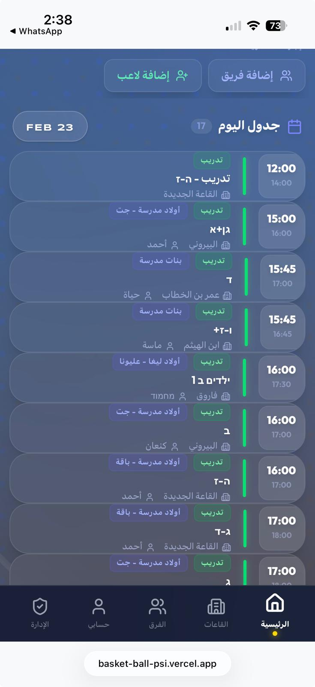
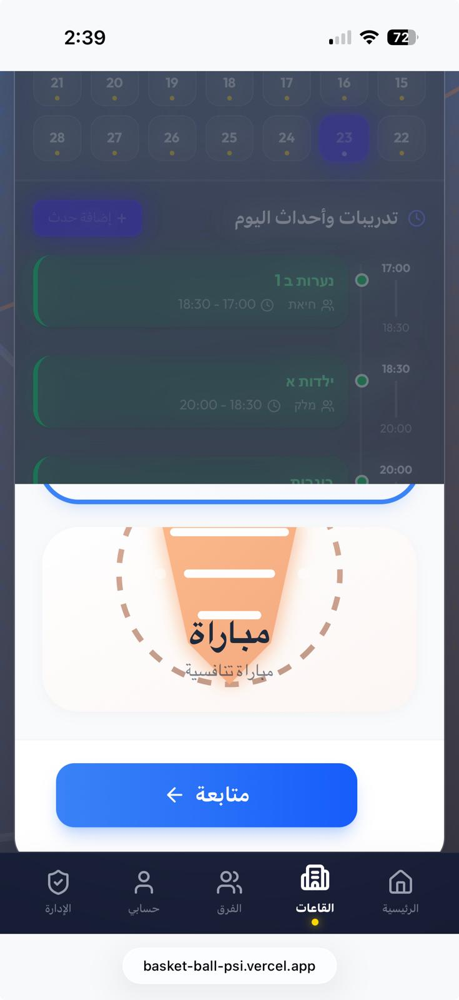
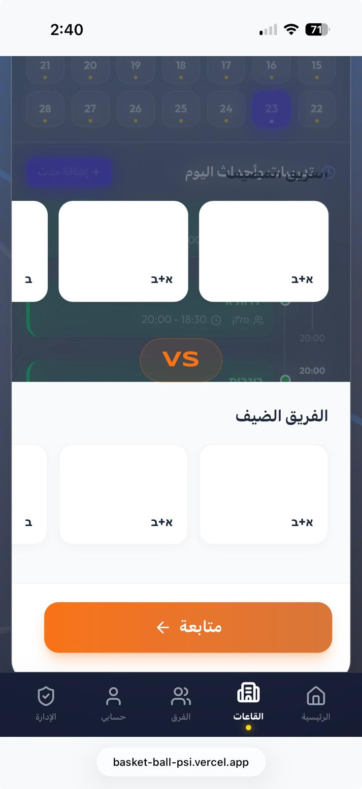
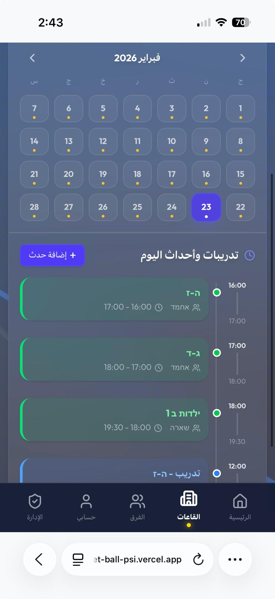
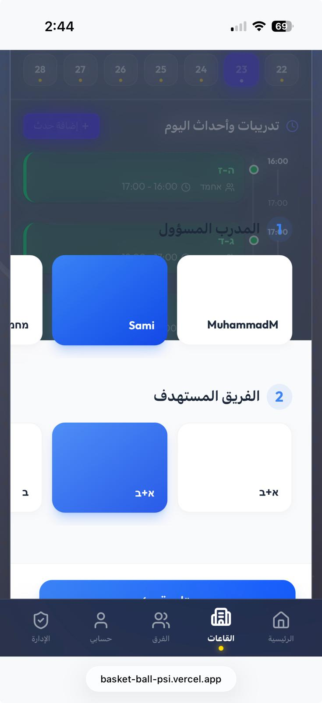
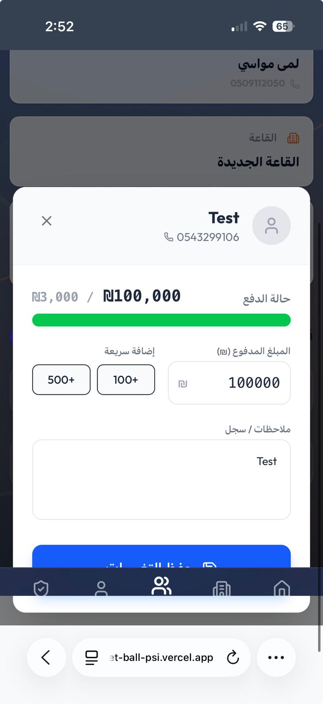

my companion manually qa's the app and got many many bugs , even tho I canot see them when I hit 

Gap between the foking rows

Add event in court is cut off and not scrollble

see how this is crooked for her
The teams should be written as input لانه بنلعب ضد فرق برا باقا and scrolling the selector is hard

Can’t edit the time in adding a game seems like it doesnt allow editing in the app version

meaning inside the card of the event it shall have a trash can that removes the event

The coach name is hard to click (multiple times clicked until selected) when adding a training from the court calendar
(here Im suggesting making new UI entirely for adding an event or making a new event , both for the hours and for the trainers and teams picking , the only thing that shall not be changed is picking if its training or game since I want a design that would be more bug free)

when deleting an event
Doesn’t really delete an event + after confirming deleting it takes me to a whole different page

UI bug

Nav bar disappears - iOS

Editing a player scroll ui bug

the arabic letters above the days which shall be sunday monday and so on dont make any sense in the calender

