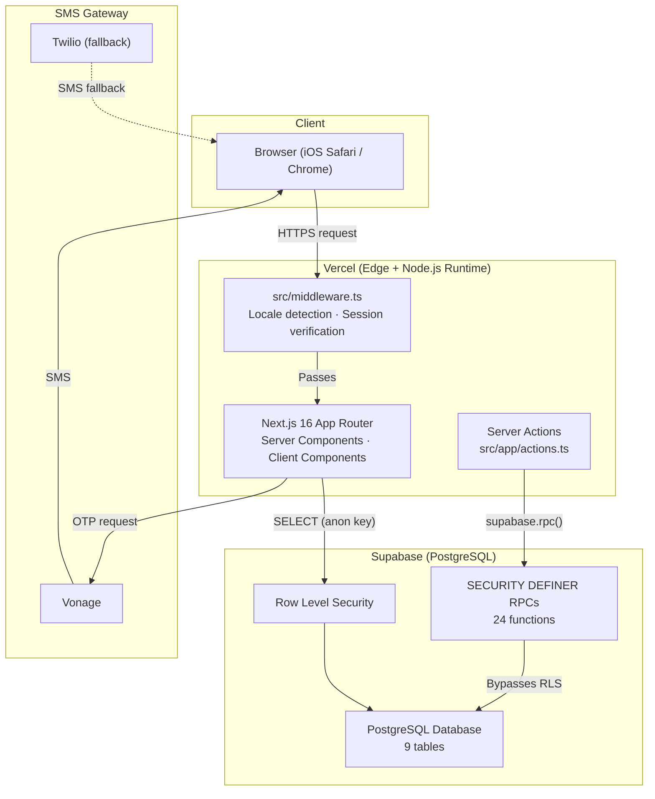
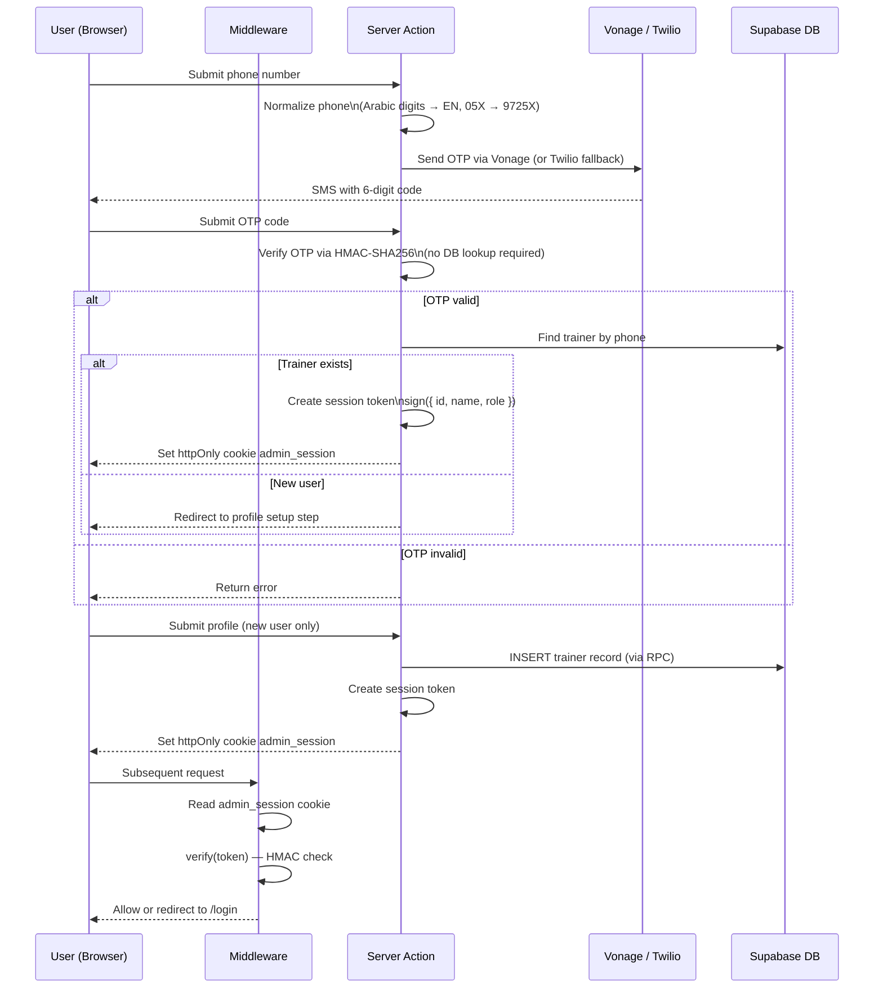
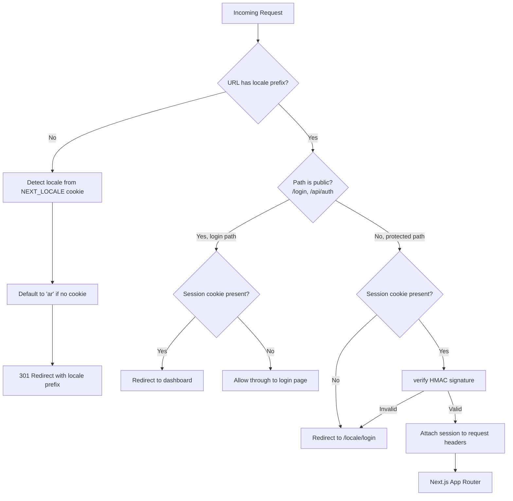
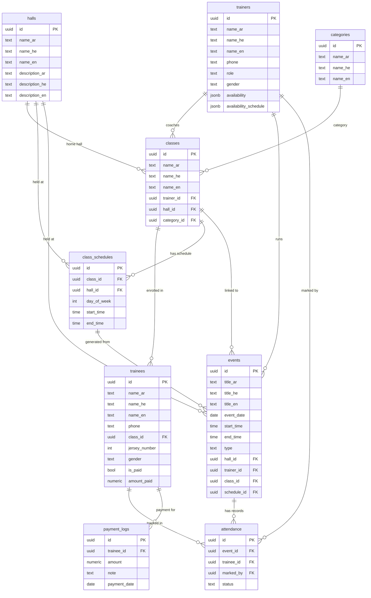
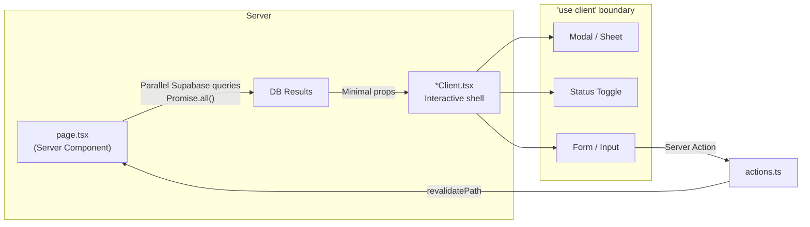
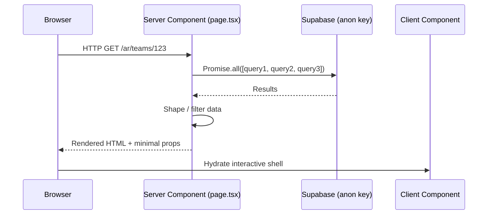
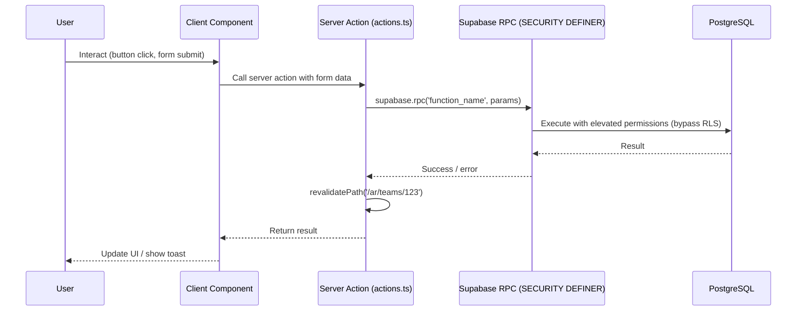

# Basketball Manager — System Architecture

**Version:** 1.0
**Date:** 2026-02-27
**Status:** Production

---

## Table of Contents

1. [System Overview](#1-system-overview)
2. [High-Level Architecture](#2-high-level-architecture)
3. [Technology Stack](#3-technology-stack)
4. [Application Structure](#4-application-structure)
5. [Authentication System](#5-authentication-system)
6. [Middleware Pipeline](#6-middleware-pipeline)
7. [Database Schema](#7-database-schema)
8. [RLS Bypass Strategy and RPC Functions](#8-rls-bypass-strategy-and-rpc-functions)
9. [Server Actions](#9-server-actions)
10. [Component Strategy](#10-component-strategy)
11. [Layout Architecture](#11-layout-architecture)
12. [Data Flow](#12-data-flow)
13. [Internationalisation](#13-internationalisation)
14. [Performance Conventions](#14-performance-conventions)
15. [Deployment](#15-deployment)

---

## 1. System Overview

Basketball Manager is a full-stack web application used by a basketball association to manage trainers, teams, trainees, hall bookings, event scheduling, attendance tracking, and payments. It is designed primarily for mobile use (iPhone, 375px viewport) and supports Arabic and Hebrew with full RTL layout.

The application is built on Next.js 16 App Router with Supabase (PostgreSQL) as the database and Vercel as the deployment platform.

---

## 2. High-Level Architecture



---

## 3. Technology Stack

| Layer | Technology | Version |
|---|---|---|
| Framework | Next.js (App Router, Turbopack dev) | 16 |
| UI Library | React | 19 |
| Language | TypeScript (strict mode) | 5.9 |
| Database | Supabase (PostgreSQL) | — |
| Auth | Custom stateless HMAC-SHA256 OTP | — |
| Styling | Tailwind CSS 4 | 4 |
| Icons | Lucide React | latest |
| SMS | Vonage / Twilio (failover) | — |
| Deployment | Vercel | — |
| Dev Server | Turbopack | — |

**Design system:** Glassmorphic dark UI with animated mesh gradient backgrounds. Mobile-first: primary design target is 375 x 812px (iPhone SE / standard).

---

## 4. Application Structure

### Directory Layout

```
src/
  app/
    [locale]/           # All routes under locale segment (ar | he)
      page.tsx          # Dashboard
      login/
      schedule/
      halls/
        [id]/
      teams/
        [classId]/
          attendance/
          add/
      attendance/
        [eventId]/
      trainers/
        [id]/
      payments/
        [classId]/
      profile/
      more/
      settings/
      reports/
      head-coach/
        import/
    actions.ts          # All server actions (40+ functions)
  components/           # Shared components, organised by domain
  lib/
    supabase/           # Supabase client helpers and types
    auth/               # Session sign / verify utilities
  middleware.ts         # Locale + auth middleware
```

### Route Inventory

| Route | Purpose | Access |
|---|---|---|
| `/[locale]/` | Dashboard — stat tiles, today's schedule, quick actions | All |
| `/[locale]/login` | 3-step login: phone → OTP → profile setup | Public |
| `/[locale]/schedule` | 7-day event list with sticky date headers | All |
| `/[locale]/halls` | Hall grid overview | All |
| `/[locale]/halls/[id]` | Hall detail with monthly calendar | All |
| `/[locale]/teams` | Team list | All |
| `/[locale]/teams/[classId]` | Team detail — roster, schedule editor, attendance link | All |
| `/[locale]/teams/[classId]/attendance` | Attendance history for a team | All |
| `/[locale]/teams/[classId]/add` | Add trainee to team | All |
| `/[locale]/attendance/[eventId]` | Live attendance sheet with status toggles | All |
| `/[locale]/trainers` | Trainer grid | All |
| `/[locale]/trainers/[id]` | Trainer profile | All |
| `/[locale]/payments` | Payment hub | All |
| `/[locale]/payments/[classId]` | Per-team payment management | All |
| `/[locale]/profile` | Current user profile | All |
| `/[locale]/more` | Secondary navigation links | All |
| `/[locale]/settings` | App settings | All |
| `/[locale]/reports` | Reporting views | All |
| `/[locale]/head-coach` | Admin panel | headcoach only |
| `/[locale]/head-coach/import` | Excel import wizard | headcoach only |

---

## 5. Authentication System

### Overview

Authentication uses a fully stateless approach. No OTP codes are stored in the database. Verification is performed via HMAC-SHA256 on the server using a shared secret.

### Auth Flow



### Session Token Format

```
base64url(JSON payload) . base64url(HMAC-SHA256 signature)
```

Payload fields: `id`, `name`, `role`, `iat` (issued-at timestamp).

### Roles

| Role | Permissions |
|---|---|
| `trainer` | Manage own teams, trainees, attendance, payments |
| `headcoach` | Full admin access including import wizard and all trainer data |

---

## 6. Middleware Pipeline



**File:** `src/middleware.ts`

The middleware runs on the Vercel Edge Runtime and handles two concerns in a single pass: locale routing and session authentication.

---

## 7. Database Schema

**Supabase Project ID:** `amzfssqkjefzzbilqmfe`

### Entity Relationship Diagram



### Table Summary

| Table | Rows (approx.) | Purpose |
|---|---|---|
| `trainers` | ~20 | Staff accounts — trainers and head coaches |
| `categories` | ~10 | Team category labels (age group, gender, level) |
| `halls` | ~10 | Physical venues / courts |
| `classes` | ~20 | Teams — each belongs to one trainer and hall |
| `class_schedules` | ~50 | Recurring weekly schedule entries per team |
| `trainees` | ~400 | Players enrolled in a team |
| `events` | ~2 000 | Training sessions and games |
| `attendance` | ~20 000 | Per-trainee attendance records |
| `payment_logs` | ~1 000 | Individual payment entries |

> **Naming note:** The database table is `classes`; the UI labels it "Teams" throughout.

---

## 8. RLS Bypass Strategy and RPC Functions

### Strategy

Supabase Row Level Security (RLS) is enabled on all tables. The application does **not** use the Supabase service role key in application code, which avoids exposing a privileged secret. Instead, all write operations are executed through `SECURITY DEFINER` Postgres functions called via `supabase.rpc()`. These functions run with the permissions of their definer (a superuser) and therefore bypass RLS.

Read operations use the anon key and rely on permissive RLS policies appropriate for the authenticated context.

### RPC Function Inventory

| Function | Domain | Description |
|---|---|---|
| `bulk_insert_trainees_from_json` | Import | Batch-insert trainees from parsed Excel data |
| `bulk_upsert_attendance` | Attendance | Insert or update multiple attendance records in one call |
| `create_trainer` | Auth | Create a new trainer record on first login |
| `delete_class` | Teams | Delete a team and cascade related records |
| `delete_event` | Events | Delete a single event |
| `delete_trainee` | Trainees | Remove a trainee from the system |
| `delete_trainer_rpc` | Trainers | Delete a trainer account |
| `ensure_events_for_schedules` | Events | Generate event rows from recurring schedule entries |
| `insert_category` | Categories | Insert a new category |
| `insert_class` | Teams | Create a new team |
| `insert_class_schedule` | Teams | Add a recurring schedule slot to a team |
| `insert_hall` | Halls | Create a new hall |
| `insert_payment_log` | Payments | Record a payment entry |
| `insert_trainee` | Trainees | Add a trainee to a team |
| `update_class` | Teams | Update team fields |
| `update_class_schedule` | Teams | Modify a recurring schedule slot |
| `update_event_time` | Events | Change start/end time of an event |
| `update_hall_rpc` | Halls | Update hall details |
| `update_trainee_payment_rpc` | Payments | Update a trainee's payment status and amount |
| `update_trainee_rpc` | Trainees | Update trainee profile fields |
| `update_trainer_profile` | Auth | Update own trainer profile |
| `update_trainer_rpc` | Trainers | Update any trainer's profile (headcoach) |
| `upsert_attendance` | Attendance | Insert or update a single attendance record |
| `upsert_event` | Events | Insert or update an event record |

---

## 9. Server Actions

All mutations are server actions defined in `src/app/actions.ts`. They run on the Node.js runtime, call the appropriate RPC, and call `revalidatePath()` to invalidate Next.js cache after each write.

### Action Groups

| Domain | Count | Example Functions |
|---|---|---|
| Auth | 4 | `sendOtp`, `verifyOtp`, `setupProfile`, `logout` |
| Events | 8 | `createEvent`, `updateEventTime`, `deleteEvent`, `upsertEvent` |
| Trainers | 8 | `createTrainer`, `updateTrainer`, `deleteTrainer`, `updateOwnProfile` |
| Teams | 5 | `createClass`, `updateClass`, `deleteClass`, `insertClassSchedule`, `updateClassSchedule` |
| Trainees | 7 | `insertTrainee`, `updateTrainee`, `deleteTrainee`, `bulkInsertTrainees` |
| Payments | 2 | `insertPaymentLog`, `updateTraineePayment` |
| Attendance | 6 | `upsertAttendance`, `bulkUpsertAttendance`, `getAttendanceForEvent` |
| Halls | 1 | `updateHall` |
| Import / Export | 4 | `importTraineesFromExcel`, `ensureEventsForSchedules` |

---

## 10. Component Strategy

### Server vs Client Split



**Rules:**
- Default to Server Components. Add `'use client'` only when the component needs `useState`, `useEffect`, `useRef`, event handlers, or browser-only APIs.
- Server pages fetch all required data in parallel using `Promise.all()` and pass processed, minimal props to client components.
- Never pass entire database result arrays through the server-client boundary. Filter and shape on the server.

### Naming Conventions

| Suffix | Meaning |
|---|---|
| `page.tsx` | Route entry point — always a Server Component |
| `*Client.tsx` | Client interactive shell for a page |
| `*Modal.tsx` | Client modal dialog |
| `*Button.tsx` | Isolated client interaction with a server action |
| `*View.tsx` | Pure presentational component (may be server or client) |

---

## 11. Layout Architecture

### Fixed Chrome

| Element | Height / Width | Required Page Class |
|---|---|---|
| Header (fixed top) | 64px | `pt-20` (80px top padding) |
| Sidebar (desktop only) | 240px | `md:ml-[240px]` |
| Bottom Nav (mobile only) | 72px + iOS safe area | `pb-24` mobile, `md:pb-8` desktop |

### Header

- Fixed at top, full width.
- Contains: app logo, global search input (debounced 300ms, runs parallel trainee and trainer queries), locale toggle.
- Hidden on login page.

### Sidebar

- `hidden md:flex` — visible only on tablet and desktop.
- 8 primary navigation items plus an admin link for `headcoach` role.
- Width: 240px, fixed left.

### Bottom Navigation

- `md:hidden` — visible only on mobile.
- 4–5 tabs. Active tab rendered with a golden glow indicator.
- Includes `padding-bottom: env(safe-area-inset-bottom)` for iPhone home bar.
- Thumb-reachable zone: all tabs are in the bottom 72px of the viewport.

### Responsive Pattern

```
Mobile (< 768px)              Desktop (>= 768px)
┌──────────────────────┐      ┌──────┬───────────────────┐
│ Header (fixed 64px)  │      │      │ Header (fixed 64px)│
├──────────────────────┤      │ Side │─────────────────── │
│                      │      │ bar  │                    │
│  Page Content        │      │ 240px│  Page Content      │
│  pt-20  pb-24        │      │      │  pt-20  pb-8       │
│                      │      │      │  md:ml-[240px]     │
├──────────────────────┤      │      │                    │
│ Bottom Nav (72px)    │      └──────┴───────────────────┘
└──────────────────────┘
```

---

## 12. Data Flow

### Read Path



### Write Path



### Cache Invalidation

Next.js page caching is used by default (no `force-dynamic`). After every server action mutation, `revalidatePath()` is called with the affected route(s). This causes the next request to that page to re-fetch fresh data from Supabase while all unaffected pages remain cached.

---

## 13. Internationalisation

| Property | Value |
|---|---|
| Supported locales | `ar` (Arabic), `he` (Hebrew) |
| Direction | RTL for both locales |
| Default locale | `ar` |
| Locale detection | `NEXT_LOCALE` cookie → default |
| Route structure | `src/app/[locale]/` — all routes under locale segment |

All user-facing text fields in the database carry trilingual columns (`_ar`, `_he`, `_en`). The `_en` column exists for internal reference and is not displayed in the UI. The active locale is used to select the appropriate column at render time.

Phone number normalisation handles Arabic-Indic and Extended Arabic-Indic digit variants, converting them to ASCII digits before sending to the SMS gateway.

---

## 14. Performance Conventions

These are mandatory rules enforced in all code:

| Rule | Detail |
|---|---|
| Parallel queries | All independent Supabase queries on a page must be wrapped in `Promise.all()` |
| No `force-dynamic` | Never export `dynamic = 'force-dynamic'`; use `revalidatePath()` instead |
| Bounded queries | Every `.select()` that could return many rows must have `.limit(N)` or a date filter |
| Debounced inputs | Search and filter inputs must debounce API calls by at least 300ms |
| No debug logs | No `console.log` in committed server components or actions |
| Selective columns | Select only required columns; use `{ count: 'exact', head: true }` for count-only queries |
| Server-first | Default to Server Components; minimise client component surface area |
| No prop drilling | Shape data on the server; pass only what the client component needs |

---

## 15. Deployment

| Property | Value |
|---|---|
| Platform | Vercel |
| Runtime | Node.js (server actions, API routes), Edge (middleware) |
| Dev command | `next dev --turbo` |
| Environment variables | `SUPABASE_URL`, `SUPABASE_ANON_KEY`, `SESSION_SECRET`, `VONAGE_API_KEY`, `VONAGE_API_SECRET`, `TWILIO_*` |

### Turbopack Note

On Windows, Turbopack may emit `"Persisting failed: Another write batch"` errors due to cache corruption. The fix is to delete the `.next` directory: `rm -rf .next`.

### Vercel Cache Strategy

- Static pages are cached by Vercel's CDN at the edge.
- `revalidatePath()` calls from server actions trigger on-demand ISR revalidation.
- No pages use `force-dynamic`; all cache invalidation is surgical.

---

*Document generated 2026-02-27. Maintained alongside the codebase.*
