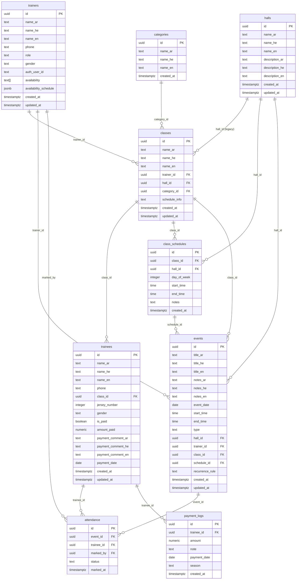

# Basketball Manager — Database Reference

**Supabase Project ID:** `amzfssqkjefzzbilqmfe`
**Engine:** PostgreSQL (via Supabase)
**Schema:** 8 tables + 1 view (`payment_logs`)

---

## Table of Contents

1. [Entity Relationship Diagram](#entity-relationship-diagram)
2. [Tables](#tables)
   - [trainers](#trainers)
   - [classes](#classes-ui-teams)
   - [trainees](#trainees)
   - [halls](#halls)
   - [events](#events)
   - [class_schedules](#class_schedules)
   - [attendance](#attendance)
   - [categories](#categories)
   - [payment_logs](#payment_logs-view)
3. [Relationships](#relationships)
4. [RPC Functions](#rpc-functions)
5. [Query Patterns](#query-patterns)
6. [Naming Conventions](#naming-conventions)

---

## Entity Relationship Diagram



---

## Tables

### trainers

Stores coach and trainer accounts. The `role` field distinguishes head coaches from regular trainers.

| Column | Type | Nullable | Notes |
|--------|------|----------|-------|
| id | uuid | NO | Primary key |
| name_ar | text | NO | Arabic display name |
| name_he | text | NO | Hebrew display name |
| name_en | text | NO | English display name |
| phone | text | NO | Unique. Israeli format: `9725XXXXXXXX` |
| role | text | NO | `'headcoach'` or `'trainer'` |
| gender | text | YES | `'male'` or `'female'` |
| auth_user_id | text | YES | Links to auth session |
| availability | text[] | YES | Array of day names (legacy) |
| availability_schedule | jsonb | YES | Array of `{ day, start, end }` objects |
| created_at | timestamptz | YES | Auto-set on insert |
| updated_at | timestamptz | YES | Auto-set on update |

---

### classes (UI: "Teams")

The `classes` table is what the UI calls "Teams". Each class belongs to one trainer and one optional category. The `hall_id` column is a legacy field; hall assignment is now managed per-schedule via `class_schedules`.

| Column | Type | Nullable | Notes |
|--------|------|----------|-------|
| id | uuid | NO | Primary key |
| name_ar | text | NO | Arabic team name |
| name_he | text | NO | Hebrew team name |
| name_en | text | NO | English team name |
| trainer_id | uuid | YES | FK → `trainers.id` |
| hall_id | uuid | YES | FK → `halls.id` (legacy) |
| category_id | uuid | YES | FK → `categories.id` |
| schedule_info | text | YES | Free-text schedule description |
| created_at | timestamptz | YES | |
| updated_at | timestamptz | YES | |

---

### trainees

Individual players enrolled in a class (team). Payment fields are stored directly on the trainee record for quick access.

| Column | Type | Nullable | Notes |
|--------|------|----------|-------|
| id | uuid | NO | Primary key |
| name_ar | text | NO | Arabic name |
| name_he | text | NO | Hebrew name |
| name_en | text | NO | English name |
| phone | text | YES | Contact number |
| class_id | uuid | YES | FK → `classes.id` |
| jersey_number | integer | YES | Shirt number |
| gender | text | YES | `'male'` or `'female'` |
| is_paid | boolean | YES | Current payment status |
| amount_paid | numeric | YES | Amount paid this cycle |
| payment_comment_ar | text | YES | Arabic payment note |
| payment_comment_he | text | YES | Hebrew payment note |
| payment_comment_en | text | YES | English payment note |
| payment_date | date | YES | Date of last payment |
| created_at | timestamptz | YES | |
| updated_at | timestamptz | YES | |

---

### halls

Physical venues where training sessions and games take place.

| Column | Type | Nullable | Notes |
|--------|------|----------|-------|
| id | uuid | NO | Primary key |
| name_ar | text | NO | Arabic hall name |
| name_he | text | NO | Hebrew hall name |
| name_en | text | NO | English hall name |
| description_ar | text | YES | Arabic description |
| description_he | text | YES | Hebrew description |
| description_en | text | YES | English description |
| created_at | timestamptz | YES | |
| updated_at | timestamptz | YES | |

---

### events

Individual occurrences of training sessions or games. Events may be manually created or auto-generated from a `class_schedules` entry (indicated by a non-null `schedule_id`).

| Column | Type | Nullable | Notes |
|--------|------|----------|-------|
| id | uuid | NO | Primary key |
| title_ar | text | NO | Arabic title |
| title_he | text | NO | Hebrew title |
| title_en | text | NO | English title |
| notes_ar | text | YES | Arabic notes |
| notes_he | text | YES | Hebrew notes |
| notes_en | text | YES | English notes |
| event_date | date | NO | Format: `YYYY-MM-DD` |
| start_time | time | NO | Format: `HH:MM:SS` |
| end_time | time | NO | Format: `HH:MM:SS` |
| type | text | NO | `'training'` or `'game'` |
| hall_id | uuid | YES | FK → `halls.id` |
| trainer_id | uuid | YES | FK → `trainers.id` |
| class_id | uuid | YES | FK → `classes.id` |
| schedule_id | uuid | YES | FK → `class_schedules.id`. Null for manual events. |
| recurrence_rule | text | YES | Recurrence descriptor (if applicable) |
| created_at | timestamptz | YES | |
| updated_at | timestamptz | YES | |

---

### class_schedules

Recurring schedule slots for a class. Each row defines a weekly time block on a given day at a given hall. The `ensure_events_for_schedules` RPC materialises these into `events` rows.

| Column | Type | Nullable | Notes |
|--------|------|----------|-------|
| id | uuid | NO | Primary key |
| class_id | uuid | NO | FK → `classes.id` |
| hall_id | uuid | YES | FK → `halls.id` |
| day_of_week | integer | NO | `0` = Sunday … `6` = Saturday |
| start_time | time | NO | Session start |
| end_time | time | NO | Session end |
| notes | text | YES | Optional notes |
| created_at | timestamptz | YES | |

---

### attendance

Records each trainee's attendance status for a specific event. One row per trainee per event.

| Column | Type | Nullable | Notes |
|--------|------|----------|-------|
| id | uuid | NO | Primary key |
| event_id | uuid | YES | FK → `events.id` |
| trainee_id | uuid | YES | FK → `trainees.id` |
| marked_by | uuid | YES | FK → `trainers.id` (who recorded it) |
| status | text | NO | `'present'`, `'absent'`, or `'late'` |
| marked_at | timestamptz | YES | Timestamp of when status was recorded |

---

### categories

Age or skill categories used to group teams (e.g., U12, U16, Senior).

| Column | Type | Nullable | Notes |
|--------|------|----------|-------|
| id | uuid | NO | Primary key |
| name_ar | text | NO | Arabic category name |
| name_he | text | NO | Hebrew category name |
| name_en | text | NO | English category name |
| created_at | timestamptz | YES | |

---

### payment_logs (View)

An audit log of payment transactions per trainee. This is a view — records are inserted via the `insert_payment_log` RPC.

| Column | Type | Nullable | Notes |
|--------|------|----------|-------|
| id | uuid | NO | Primary key |
| trainee_id | uuid | YES | FK → `trainees.id` |
| amount | numeric | NO | Amount of this payment |
| note | text | YES | Free-text note |
| payment_date | date | YES | Date of the payment |
| season | text | YES | Season label (e.g., `'2024-25'`) |
| created_at | timestamptz | YES | |

---

## Relationships

| Parent | Child | Foreign Key | Cardinality |
|--------|-------|-------------|-------------|
| trainers | classes | `classes.trainer_id` | 1 trainer → N classes |
| categories | classes | `classes.category_id` | 1 category → N classes |
| halls | classes | `classes.hall_id` | 1 hall → N classes (legacy) |
| classes | trainees | `trainees.class_id` | 1 class → N trainees |
| classes | class_schedules | `class_schedules.class_id` | 1 class → N schedules |
| halls | class_schedules | `class_schedules.hall_id` | 1 hall → N schedules |
| halls | events | `events.hall_id` | 1 hall → N events |
| trainers | events | `events.trainer_id` | 1 trainer → N events |
| classes | events | `events.class_id` | 1 class → N events |
| class_schedules | events | `events.schedule_id` | 1 schedule → N events (auto-generated) |
| events | attendance | `attendance.event_id` | 1 event → N attendance records |
| trainees | attendance | `attendance.trainee_id` | 1 trainee → N attendance records |
| trainers | attendance | `attendance.marked_by` | 1 trainer → N attendance records (recorder) |
| trainees | payment_logs | `payment_logs.trainee_id` | 1 trainee → N payment log entries |

### Indirect Relationship: Event → Trainees

There is no direct foreign key from `events` to `trainees`. To retrieve trainees for a given event, traverse:

```
event.trainer_id → trainers.id → classes.trainer_id → classes.id → trainees.class_id
```

Or equivalently via `class_id` when present on the event:

```
event.class_id → classes.id → trainees.class_id
```

---

## RPC Functions

All RPC functions use `SECURITY DEFINER` to bypass Row Level Security. Call them via `supabase.rpc('function_name', params)`. Never use the service role key on the client side.

### Attendance

| Function | Description |
|----------|-------------|
| `bulk_upsert_attendance` | Insert or update multiple attendance records in a single call |
| `upsert_attendance` | Insert or update a single attendance record |

### Events

| Function | Description |
|----------|-------------|
| `upsert_event` | Insert or update an event |
| `delete_event` | Delete an event by ID |
| `update_event_time` | Update the start/end time of an existing event |
| `ensure_events_for_schedules` | Materialise `class_schedules` rows into concrete `events` rows for a date range |

### Classes

| Function | Description |
|----------|-------------|
| `insert_class` | Create a new class (team) |
| `update_class` | Update class fields |
| `delete_class` | Delete a class by ID |
| `insert_class_schedule` | Add a recurring schedule slot to a class |
| `update_class_schedule` | Update an existing schedule slot |

### Trainers

| Function | Description |
|----------|-------------|
| `create_trainer` | Create a new trainer record |
| `update_trainer_profile` | Update the authenticated trainer's own profile |
| `update_trainer_rpc` | Admin update for any trainer record |
| `delete_trainer_rpc` | Delete a trainer by ID |

### Trainees

| Function | Description |
|----------|-------------|
| `insert_trainee` | Add a single trainee to a class |
| `update_trainee_rpc` | Update a trainee's profile fields |
| `delete_trainee` | Delete a trainee by ID |
| `update_trainee_payment_rpc` | Update payment status and amount on a trainee record |
| `bulk_insert_trainees_from_json` | Batch-insert multiple trainees from a JSON payload |

### Halls

| Function | Description |
|----------|-------------|
| `insert_hall` | Create a new hall |
| `update_hall_rpc` | Update an existing hall's details |

### Categories

| Function | Description |
|----------|-------------|
| `insert_category` | Create a new category |

### Payments

| Function | Description |
|----------|-------------|
| `insert_payment_log` | Append a payment log entry for a trainee |

---

## Query Patterns

### Parallel independent queries

When two queries do not depend on each other's result, run them concurrently with `Promise.all`.

```ts
const [{ data: team, error: teamError }, { data: trainees, error: traineesError }] =
  await Promise.all([
    supabase
      .from('classes')
      .select('id, name_ar, name_he, name_en, trainer_id, category_id')
      .eq('id', classId)
      .single(),
    supabase
      .from('trainees')
      .select('id, name_ar, name_he, name_en, jersey_number, is_paid')
      .eq('class_id', classId)
      .limit(100),
  ])
```

### Bounded date-range query

Never fetch an unbounded set of events. Always constrain by date range and apply a row limit.

```ts
const threeMonthsAgo = new Date(Date.now() - 90 * 24 * 60 * 60 * 1000)
  .toISOString()
  .split('T')[0]

const { data: events, error } = await supabase
  .from('events')
  .select('id, event_date, start_time, end_time, type, hall_id')
  .gte('event_date', threeMonthsAgo)
  .order('event_date', { ascending: false })
  .limit(50)
```

### Count-only query

When you only need a row count, use `{ count: 'exact', head: true }` to avoid transferring data.

```ts
const { count, error } = await supabase
  .from('trainees')
  .select('*', { count: 'exact', head: true })
  .eq('class_id', classId)
```

### Calling an RPC function

```ts
const { data, error } = await supabase.rpc('bulk_upsert_attendance', {
  p_event_id: eventId,
  p_records: attendancePayload,
})
```

### Upsert via RPC (mutations)

After any successful mutation, call `revalidatePath` so Next.js invalidates the relevant cached pages.

```ts
'use server'

import { revalidatePath } from 'next/cache'
import { createClient } from '@/lib/supabase/server'

export async function markAttendance(eventId: string, records: AttendanceRecord[]) {
  const supabase = createClient()

  const { error } = await supabase.rpc('bulk_upsert_attendance', {
    p_event_id: eventId,
    p_records: records,
  })

  if (error) throw new Error(error.message)

  revalidatePath(`/attendance/${eventId}`)
}
```

### Sequential query (result dependency)

When query B depends on query A's result, await A first, then run subsequent independent queries in parallel.

```ts
// Step 1: fetch the event to get trainer_id
const { data: event, error: eventError } = await supabase
  .from('events')
  .select('id, trainer_id, event_date')
  .eq('id', eventId)
  .single()

if (eventError || !event) return notFound()

// Step 2: fetch trainer and their class in parallel (both depend on event.trainer_id)
const [{ data: trainer }, { data: teamClass }] = await Promise.all([
  supabase
    .from('trainers')
    .select('id, name_ar, name_he, name_en')
    .eq('id', event.trainer_id)
    .single(),
  supabase
    .from('classes')
    .select('id, name_ar, name_he, name_en')
    .eq('trainer_id', event.trainer_id)
    .single(),
])
```

---

## Naming Conventions

### Table vs UI terminology

The database uses `classes` for what the application UI calls "Teams". This is a historical naming decision preserved for backward compatibility. When reading code or writing queries, treat them as synonymous.

| UI label | DB table |
|----------|----------|
| Teams | `classes` |
| Team | `classes` (single row) |
| Players / Trainees | `trainees` |
| Coach | `trainers` (where `role = 'headcoach'`) |
| Trainer | `trainers` (where `role = 'trainer'`) |
| Session / Event | `events` |
| Hall / Venue | `halls` |

### Multilingual columns

Every user-visible text field is stored in three language variants using a consistent suffix pattern:

| Suffix | Language |
|--------|----------|
| `_ar` | Arabic |
| `_he` | Hebrew |
| `_en` | English |

Example: `name_ar`, `name_he`, `name_en` on the `classes` table.

### Phone number format

All phone numbers are stored in the Israeli normalised format without separators:

```
9725XXXXXXXX
```

Where `972` is the country code and `5XXXXXXXX` is the local mobile number.
